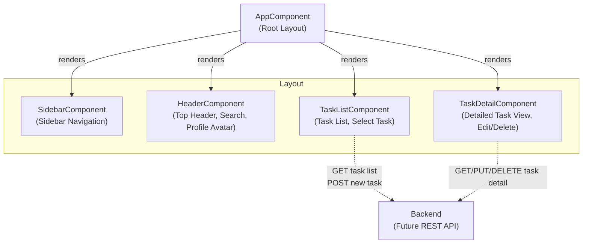

# Task Manager Frontend – Architecture Documentation

## Overview

The `task_manager_frontend` is a standalone Angular application providing a modern, minimalistic user interface for a task management system. It is architected to support task creation, updating, prioritization, deadline management, and progress tracking, and is ready to extend to include features such as user authentication and REST API integration with a backend service.

The structure centers on a **single-page dashboard layout** with sidebar navigation, a task list, and a detailed task view. The application is currently a frontend-only implementation, with business logic for tasks stubbed in components and clear extension points for future backend connectivity.

---

## Architecture Diagram



---

## Textual Overview

### Application Entry

- The Angular app is bootstrapped using `AppComponent` as the root, configured in `main.ts` with `appConfig` (`src/app/app.config.ts`).
- Routing is minimal: the only defined route is the root (`/`), rendering the main dashboard. There are extension comments in the code for future route guards, authentication, and nested routes.

### Major UI Components

#### 1. `AppComponent`
- Serves as the root container and layout manager.
- Combines Sidebar, Header, Task List, and Task Detail into a responsive, flexbox layout.
- Handles app-wide state such as authentication (currently a stub).

#### 2. `SidebarComponent`
- Minimal navigation component, left-aligned.
- Displays branding/logo and nav links for "Tasks", "Progress", and "Settings".
- Navigation is currently nonfunctional (no routing logic yet).

#### 3. `HeaderComponent`
- Sticky header with a search input and profile avatar placeholder.
- Search event handling is stubbed for future task filtering; no real event emissions yet.

#### 4. `TaskListComponent`
- Shows a list of tasks with dynamic selection (dummy sample data in the component).
- User can select a task to see its detail (selection affects visual appearance only; no state-lifting yet).
- Provides stub for task filtering, which will be linked to search and backend in later versions.

#### 5. `TaskDetailComponent`
- Displays editable details for a selected task.
- Allows editing task fields (title, description, due date, priority, progress, subtasks), but these are local to the component for now.
- Includes stub methods for mark-complete, delete, and save–to be connected to state and backend logic in the future.

### Routing and State Management

- Routing is simple: a single route at `'/'` mapped to `AppComponent`.
- All state is managed locally within each component for now.
- No global state management (like NgRx) or cross-component data transfer is present yet.

---

## Frontend Component Structure

```
AppComponent (root)
├─ SidebarComponent (<app-sidebar>)
├─ HeaderComponent (<app-header>)
├─ Content Body
│   ├─ TaskListComponent (<app-task-list>)
│   └─ TaskDetailComponent (<app-task-detail>)
```

- Styling uses a modern, responsive layout defined in CSS with flexbox and media queries.
- All components are defined as Angular **standalone components**, using `standalone: true`, simplifying module dependencies.

---

## Interactions with Backend (API)

- Currently, there are **no implemented API calls**. Methods that would trigger backend actions (task fetch, update, delete) are present as stubs in `TaskListComponent` and `TaskDetailComponent`.
- The code is prepared for integration with a backend providing a RESTful API for tasks.
- The Express server in `src/server.ts` is prepared for SSR and static asset serving, and is scaffolded for easy future extension with API proxy routes.

### API Integration Outline (for future work)
- Fetch tasks for `TaskListComponent` with HTTP GET to `/api/tasks`
- Send updates/deletes for current task in `TaskDetailComponent` to `/api/tasks/:id`
- Implement real authentication and route guards in router and AppComponent

---

## Extensibility

- Easy to add routing for different panels/views (auth, settings, progress).
- The present structure supports stateless design and is ready for service-based state lifting and backend API connection.
- CSS and layout are separated cleanly for theming and branding updates.

---

## File Map

- `src/app/app.component.ts` and `.html`: Root layout and container.
- `src/app/sidebar/sidebar.component.ts` and `.html`: Sidebar navigation.
- `src/app/header/header.component.ts` and `.html`: Main header bar.
- `src/app/task-list/task-list.component.ts` and `.html`: Task list display and stub selection.
- `src/app/task-detail/task-detail.component.ts` and `.html`: Task detail editing interface.
- `src/app/app.routes.ts`: Routing config.
- `src/app/app.config.ts`: Angular application providers and config.

---

## Summary

The current architecture lays a solid groundwork for an maintainable, testable, and extensible task management frontend. Real API integration, cross-component data sharing, authentication, and production-grade state management are present as extension spots, enabling straightforward enhancement with minimal refactor.

